# **Capstone 2017 Documentation**

## **Team Information**

**Team Name:** Squad

**Mission Statement:** Our mission is to gather news articles and then categorizes them based upon similarity after processing our data with Natural Language Processing techniques. We will provide visualizations of our results to user via a web application. By doing this we hope to expose trends in the news.

#### Team Members:
- **Zach Bryant:** Nickname = Zen Master Zach. I work on campus as an IT Support Specialist. Yes, I save lives. Really though, I am in charge of keeping all the printers in the computer labs filled with paper. I can get you swipe access to the labs for after hour access ;) I am a senior in Computer Science and will graduate December 2017.


- **Kurt Bognar:** Senior at MU Majoring in Computer Science with a Minor in Math. I'm a research for the university aiding in the creation of new tools and algorithms for Association-Rule Mining.  


- **Ali Raza:** I am a senior at the University of Missouri studying Computer Science. I do research at the iDAS Lab where I am currently developing a data mining library.   


- **Jared Welch:** Senior at the Univeristy of Missouri. Passionate about improving my skills. Excited for the potential of our application.   


- **Justin Renneke:** Senior undergraduate of Computer Science at the University of Missouri, graduating December '17.  Interested in machine learning, data analysis, cloud computing, and using Python to conquer the galaxy.      


## Introduction

#### Problem Definition
News articles generate massive amounts of data. Following the climactic nature of the 2016 Presedential Election due to the disimmenation of false news, it has become evident that it is important to analyze news articles. However, up until recent years, it has not been possible to effictively analyze this data due to computational limitations. However, recent advances in High Performance Computing, Data Analytics, and Machine Learning have made it possible to gather, store, and analyze news articles. We propose a model to cluster news articles based upon similarity and then provide data visualizations based upon the generated clusters and analysis done.

#### Problem Resolution

We propose the following software solution:
- Scrape news articles.
- Pre-process using NLP and then perform TFIDF.
- Cluster news articles based on the similarity of TFIDF vectors.
- Display visualizations

## Changelog for software

### NewsArticleScraper - Version 1.1

- Initial features:

	- automatically scheduled at time during the night

	- each site runs as an independent process, so any error for a site does not hurt the flow of the scraper itself

	- as articles are scraped from a site, they are pushed into the database, including the text, title, authors, url, and other relevant info

- Version 1.1:

	- add additional sites to list

	- clean up inserts to database

	- add custom logging functionality, including error and information log files

	- more try catch error checking to improve error logs

## **Requirements**

### User Requirements
* User can explore visualizations of statistics and analysis of news data using a graphical interface to navigate.
* User can submit an article to be analyzed and view the results of the analysis of the article compared to our dataset; the results will be classification data based upon our models.
* **User Requirements Stretch Goals:**
	* User can peform custom searches against the database, yielding search results related to statistics on the news article data

### Functional Requirements
* Given a list of news websites, scrape every new article on every site and return and store in a database the following data from each article: Article title, author name(s), date published, article body text, raw html, and webpage url.
* Perform natural language processing analysis on articles to clean the data and generate features such as named entities, bag of word counts, and term frequency-inverse document frequency metrics.
* Categorize articles into groups based on topic determined by performing machine learning-based cluster analysis using generated features.
* A web application will provide users with visualizations of the clustered topics and their articles.
* The web application will allow a user to provide the url of a specific news article, scrape the webpage, assign the article to a topic category, and inform the user of the result.
* **Functional Requirements Stretch Goals**
	* Allow users to perform custom searches of the article database and return data visualizations based on metrics such as frequency of occurrence, trends of occurrence over time, and relation to other topics.
	* Create a scrolling wordcloud graphic to visualize changes in overarching news trends over time.
	* Perform sentiment analysis on articles and visualize the results.

### Non Functional Requirments
* The server is expected to have a 99% availbility.
* Each layer of the system should be backed-up weekly
* The web application will have HTTPs encryption with a valid SSL certificate.
* The software will be written using modular OOP practices to allow for easy addition of new features.
* The web application will be designed to be compatible on mobile and tablet devices.
* The system will decouple an RDS cloud database from computational resources to enable vertical scaling as needed.
* **Non Functional Requirements Stretch Goal**
	* Response Time: Real time article classification

### System Requirements
* The project will be hosted on decoupled Amazon AWS instances.
	* A web scraper, database system, and web applciation will each have their own isolated instance.
	* The system will auto scale for intensive data analysis and improved response time during high usage situations.
* A relational database will be used in order to be able to accurately model the data and perform advanced queries. 
	* The database should be large enough to store a massive dataset.
	* The databse should be indexed so efficient queries can be performed. 
* The computational processing power must be sufficient enough to not bottleneck the clustering, analysis, and data visualization process.
* The Random-Access-Memory must be high enough to minimize reading from disk during computationally intensive tasks.
* **System Requirments Strech Goals:**
	* Store articles using a distributed framework such as Hadoop.
	* Implement a cluster computing system and perform parallel analysis in order to drasticlly improve computational speed.

## **Design**

### Phase I: System Design
We will be deploying our project within Amazon Web Services. There are two architecture proposals: one for the prototyping phase (which will be the entire extent of the capstone project) and one for a business model deployment (in case we want to deploy for real world use).

Decoupling and auto scaling lie at the heart of each design. A decoupled web scraping instance will allow our web scraping to continue to run uninterrupted in an automated environment. Auto Scaling groups of larger EC2 instances will allow the design to scale up for processing intensive data analysis and faster response to user queries when under load, while conserving resources by scaling down when the system is idle. To achieve this, the database must be decoupled as well.
#### AWS Prototyping Deployment
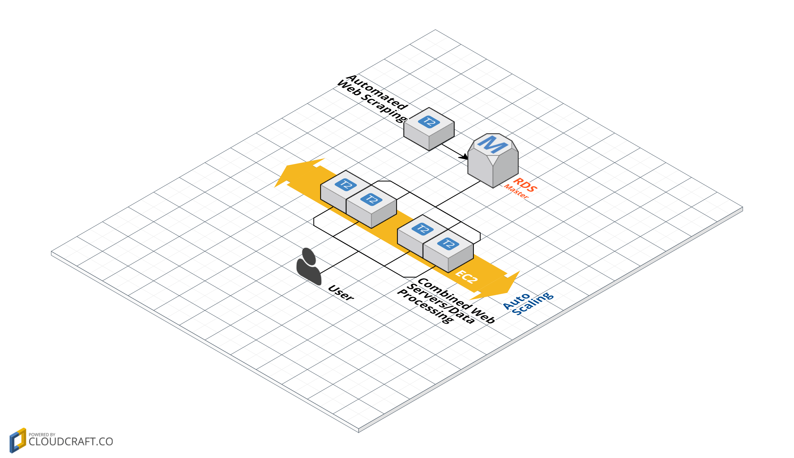
Features:
* Auto Scaling combined Web Servers/Data Processing
	* This provides scale-up capability when we need to do data processing and to process individual user queries in a prototyping environment
	* Saves money by reducing resource consumption since we will not need to handle many users in a prototyping environment and we can afford to sacrifice some responsiveness for the sake of cost
* Single, decoupled RDS database
* Decoupled web scraper
#### AWS Business Model Deployment

Features:
* Elastic load balancing will redirect work and balance load at two levels: User access of web servers on the front end and data processing and data queries on the back end.
* Multiple auto scaling groups will provide high performance and redundancy across AWS availability zones for a larger business environment deployment
	* SSD-based M3 web server auto scaling group will provide a high performance cluster for front-end processing
	* AWS Elastic block store-based M4 data processing auto scaling group will provide high processing capacity for data analysis and queries
	* Decoupled RDS database scaling group with a Master RDS database feeding RDS Read Replicas will allow us to easily scale manually to provide high database throughput for intense data queries
* Decoupled web scraper will continue to run its relatively undemanding task undisturbed
### Phase II: Web Scraping and Data Design

This project will require a large database of news articles and their associated metadata. To this purpose we have built a web scraper to scrape articles from news sites and a data warehouse to store the articles and their metadata. As of the time of writing, we have collected over 30,000 articles and plan to run the scraper through the summer to accumulate a few hundred thousand articles for data analysis in Capstone II.

#### Web scraper
##### Overview
* Parses a list of multiple news sites. This list is provided by a JSON file containing entries with a site name and URL.
* Carefully designed to avoid website's banning our IP
  * The parser is run automatically every day at a random time between 2 AM and 6 AM by using the apscheduler Python library.
  * A random wait is added between page scrapes
  * Runs with threading on each site, but limited to 2 threads to avoid stressing site's resources
* Implements logging to help with troubleshooting an otherwise fully automated program
* Every individual site crawl and scrape is forked out as a separate process to improve performance and avoid memory issues
##### Python's Newspaper Library  

[Link to Newspaper library Homepage](http://newspaper.readthedocs.io/en/latest/)

The Newspaper library is specifically designed to scrape articles from news websites. Newspaper itself is based on Python's popular BeautifulSoup and Goose parsing libraries. This library allows us to cleanly scrape news articles from a wide variety of websites - a challenge that would otherwise be incredibly time consuming. The library accomplishes this by: querying a website's home page, crawling through all the links associated with the website, building a tree structure to represent it, then scraping and parsing every previously unseen article in the tree.

Using this library, we are able to collect the following data from every article:
* Title
* Primary author (if exists)
* Secondary authors (if exists)
* Date published (if exists)
* URL
* Body text
* Raw html

The library also has a memoization capability that we are using. This allows us to scrape only new articles for every subsequent scrape of a site.

**Scraper Code/Pseudocode**
```
# Open database connection
# Read in site list JSON

# Enter core scraping code
for site in site_list:
		child_id = os.fork()

		if child_id == 0:			
			name = site['name']
			url = site['url']
			# if a site should throw an exception for any reason (maybe bad url), catch it, pass, and move to next site
			try:
				paper = newspaper.build(url,
						keep_article_html=True,
						fetch_images=False,
						memoize_articles=True,	# track the articles we have already scraped from session to session
						MIN_WORD_COUNT=200,		# this doesn't seem to be having any affect
						number_threads=2,
						request_timeout=12,
						thread_timeout=3)
				total = paper.size()
				numScraped = total
				authors = []
				secondAuth = ''

				for x in range(0,numScraped):
					sleep(randint(3,6))
					if paper.articles[x] != None:
						paper.articles[x].download()
						if paper.articles[x].is_downloaded:
							if paper.articles[x].html != None:
								paper.articles[x].parse()
								# Ensure article is long enough to be valid
								if len(nltk.word_tokenize(paper.articles[x].text)) > 200:
									html = paper.articles[x].article_html.replace('\n', ' ')
									title = (paper.articles[x].title)
									url = paper.articles[x].url
									published_date = paper.articles[x].publish_date
									authors = paper.articles[x].authors
									text = paper.articles[x].text.replace('\n', ' ')
			except Exception as e:
				logging.error("::Exception:Scrapping error for site: " + name + "::")
				logging.error("::Exception: " + str(e) + "::")
				pass
			os._exit(0)									
# Clean author strings
# Insert into database
# Log any other errors
```
#### Data Design
* RDBMS: PostgreSQL is the database system to be used for a variety of reasons:
	- It is a relational database which is needed because the data being gathered by our scraper has many complex relationships.
	- PostgreSQL supports advanced data-types such as JSON while also providing object features which will allow for easy object-relational mapping if needed.
* ETL Pipeline: 
	* Extaction: The articles are extracted by a webscraper. The scraper places all the data collected into a single database table. 
	* Transformation: The data is organized into relational tables through SQL queries.
	* Loading: The relational tables will be used in conjuction with machine-learning analysis to gather meanigful and interesting information.
* ERD Diagram (or put it under System design, idk)

### Phase III: Data Analysis

#### Pre-Processing and Feature Extraction

* ##### Natural Language Processing
 	Various NLP methods will play a key role in cleaning our data and extracting features for use in machine learning analysis. Some of these methods do similar things in different ways and we will have to explore their viability as we explore our data.
	* ###### **Removal of Stopwords**  
		Stopwords are the very common words in the English language such as 'the', 'there', 'from', etc that provide little to no information on their own. We will use NLP to remove these words before performing further analysis. Python's NLTK library offers predefined lists of stopwords and functions to easily accomplish this.

		Example code:
		```
		from nltk.corpus import stopwords
		stopwords.words('english')
		# For every article in the database, filter out the stopwords and return the filtered text using a list comprehension
		for article in article_database:
			filtered_article = [word for word in word_list if word not in stopwords.words('english')]
		```
	* ###### **Stemming**  
		Stemming is the process of reducing topically similar words to their roots. For example, “stemming,” “stemmer,” “stemmed,” all have similar meanings; stemming reduces those terms to “stem.” This is an important feature for understanding the nature of a text's topic, which would otherwise view those terms as separate entities and reduce their importance in the model. The NLTK Python library offers a stemmer function based on the most widely used stemming algorithm: Porter's stemmer.
		```
		from nltk.stem.porter import PorterStemmer

		# Create p_stemmer of class PorterStemmer
		p_stemmer = PorterStemmer()

		# stem tokens by applying the stemmer to every token in a list of tokens, returning a list of stems
		texts = [p_stemmer.stem(i) for i in tokens_list]
		```  
	* ###### **Lemmatization**  
		Lemmatization is similar in concept to stemming, but there are important differences. Both are an attempt to find the root of a word from amongst its many forms to reduce data dimensionality, but, where stemming uses a relatively unsubtle chopping heuristic to chop word endings, lemmatization uses a more comprehensive approach that takes into account the parts of speech surrounding the word in question. For example: both stemming and lemmatization would derive 'stem' from 'stemming,' 'stemmer,' and 'stemmed'; however, only lemmatization would derive 'be' from 'am', 'are', and 'is.' This increases accuracy but at the price of performance. NLTK offers lemmatization via the WordNetLemmatizer.
		```
		from nltk.stem import WordNetLemmatizer
		sent = "cats running ran cactus cactuses cacti community communities"

		wnl = WordNetLemmatizer()
		" ".join([wnl.lemmatize(i) for i in sent.split()])
		# outputs 'cat running ran cactus cactus cactus community community'
		```
	* ###### **Named Entity Extraction**  
		Named entity extraction attempts to find all named entities within a text document and categorize them as a person, location, organization, etc. The Stanford NLP library is recognized as being the best at this and Python offers access to this Java library with a wrapper. Example:
		```
		from nltk.tag import StanfordNERTagger
		from nltk.tokenize import word_tokenize

		text = "The President of the United States is named Donald Trump and he has several children including Donald Trump Jr., Invanka Trump, and a son-in-law: Jared Kushner. He also has a wife named Melania. President Trump is the defacto head of the Republican Party, even though he identified as a Democrat for most of his life. The Republicans have been slow to embrace Mr. Trump."

		# Tokenize the text
		tokenized_text = word_tokenize(text)
		# Run the text through the tagger
		categorized_text = st.tag(tokenized_text)
		# This will return labeled tuples and, after further manipulation, we will get a list of tagged entity tuples:
		[('United States', 'LOCATION'), ('Donald Trump', 'PERSON'), ('Donald Trump Jr.', 'PERSON'), ('Invanka Trump', 'PERSON'), ('Jared Kushner', 'PERSON'), ('Trump', 'PERSON'), ('Melania', 'PERSON'), ('Trump', 'PERSON'), ('Republican Party', 'ORGANIZATION'), ('Trump', 'PERSON')]
		```
	* ###### **Keyword Extraction**  
		Keywords attempt to describe the main topics expressed in an article. Python offers an easy to use keyword extraction library called RAKE.

		[This link](https://www.airpair.com/nlp/keyword-extraction-tutorial) offers a tutorial on the RAKE workflow.
	* ###### **Frequency Distribution**  
		A frequency distribution counts the number of times every word appears in a text. NLTK offers this functionality with the FreqDist() function.
		```
		import nltk

		sentence = 'How much wood would a wood chuck chuck if a wood chuck could chuck wood?'

		tokens = nltk.word_tokenize(sentence)
		fdist = nltk.FreqDist(w.lower() for w in tokens)

		# returns: 'wood': 4, 'chuck': 4, 'a': 2, 'would': 1, 'could': 1, 'how': 1, 'much': 1, 'if': 1
		```
	* ###### **Term Frequency - Inverse Document Frequency (TF-IDF)**  
		TF-IDF is a way to score the importance of words (or "terms") in a document based on how frequently they appear across multiple documents. If a word appears frequently in a document, it's important. Give the word a high score. But if a word appears in many documents, it's not a unique identifier. Give the word a low score. Python's scikit learn toolkit provides the sklearn library with this functionality.
		```
		from sklearn.feature_extraction.text import TfidfVectorizer

		# create a TfidfVectorizer object
		tfidf = TfidfVectorizer(tokenizer=tokenize, stop_words='english')
		# give the vectorizor a dictionary of documents containing document:content pairs to vectorize
		tfs = tfidf.fit_transform(token_dict.values())
		```
		The code snippet seen above, if run on a corpus containing the works of Shakespeare, will return a matrix containing the following values for the selected words:  
	unseen  -  0.309281094362  
	lord  -  0.156737043549  
	king  -  0.164996828044  
	juliet  -  0.544613034225  
* #### NLP Workflows
	* Main NLP pipeline from raw body text through TF-IDF.

		Lemmatization and Stemming do similar things, but with vastly different tradeoffs in accuracy vs performance. The choice to use one or the other will only become clear as we explore our data. Any process that has a high computational cost should be stored in the database so it never has to be re-computed (in the end we may choose to store every stage of the analysis in our database, but the ones shown here for sure should be).  
	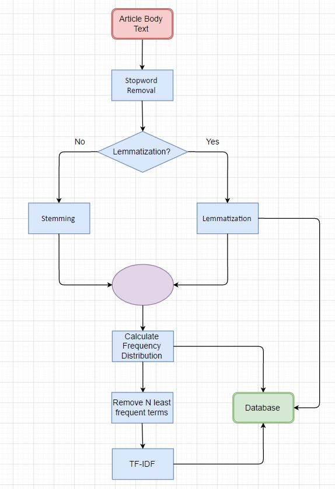
	* Named Entity Extraction and Keyword Extraction

		Note that this is shown in a separate diagram for the sake of clarity but these processing stages will probably be incorporated into the larger pipeline shown above for sake of simplicity in data pipelining.  
	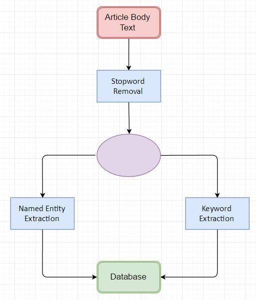

#### Machine Learning Analysis

This section will briefly outline the machine learning techniques we intend to use within this project.

* ##### Unsupervised Learning
	* **Clustering**

		At a high level, clustering is simply a process of letting data group together by placing points near those other data points that
	are more similar; of course more different data points would be farther away from each other. This allows the data to create clusters,
	simply meaning groups of similar data points. In our case, we will use K-means clustering, a technique more thoroughly discussed in the
	research paper about this topic. The most important aspect is that the data clusters are based purely on the similarity of their keywords,
	and at a later step the clusters will be characterized using training data.  

		Another important thing to mention is that articles can overlap with their topics, so it is important not to try to over distinguish
	clusters from each other, as overlap is expected with this type of dataset. K-means clustering might need some modifications in order to
	ensure the overlap is not lost (if it is significant).
* ##### Supervised Learning
	- **K-nearest Neighbors and Distinguishing Clusters**

		We will be employing the classic KNN technique within our project in a unique way. Once we have created clusters from the data, we
	will supply training data, and based upon that training data and its nearest neighbors, we can hopefully somewhat classify our clusters
	based on the training data and its placements within. KNN will be the way we calculate the proportion of our training points within clusters. For further details about KNN check the research paper related to clustering.  

		Further, once we have chosen a fixed set of so-called 'topic clusters', we can grow these clusters as we add more datasets, hopefully
	creating more diverse and accurate classification of new articles as the model improves through laws of big numbers in statistics.

	* **Sentiment Analysis**  
	Sentiment analysis is a supervised learning process of classifying text as having either a neutral, positive, or negative sentiment. The classic example analyzes movie reviews. A sentiment analysis classifier is trained on a subset of data from a dataset containing reviews of movies that have already been rated as being good movies or bad movies by viewers with the goal of being able to classify new, uncategorized reviews as being positive or negative. The classifier is then tested on the remaining subset of the data to check for correctness of predictions.

	 	The accuracy of sentiment analysis is heavily dependent upon the training data provided to it, especially in its similarity to the target data.	Research shows that even human raters agree on text sentiment only 79% of the time, so an algorithm that is 70% accurate is doing a very good job.

		There are two main challenges in analyzing sentiment from news articles:  
		1. Reporting in general purposefully employs a neutral style of language and it may be hard to extract meaningful sentiment classification results when the authors are making a conscious effort to employ neutral language.
		2. Finding a labeled dataset similar enough to our own data so a sentiment classifier trained on the labeled dataset can provide meaningful results when analyzing our news article dataset. There are a large number of sentiment datasets regarding things such as Tweets, movie reviews, and product reviews, but datasets labeling news articles might be difficult or impossible to find so we might have to creatively combine more generalized sentiment analysis techniques or label some of our data by hand.  

		To address the potential issues raised in point 2 above, NLTK offers some generalized text corpora labeled with sentiment that could be used as training data. These include the opinion_lexicon containing a list of positive and negative words in English, and the sentence_polarity corpus containing over 10,000 sentences tagged as positive or negative.

		Finally, Python's NLTK and Sklearn libraries offer machine learning sentiment analysis algorithms. NLTK's NaiveBayesClassifier is the most widely used.

		Pseudocode for sentiment analysis:
		```
		from nltk.classify import NaiveBayesClassifier

		# import a dataset labeled by sentiment
		# Separate the dataset into training data (call it training_set) and testing data  (test_set)
		# Majority split should be training data, i.e. 75% training/25% test

		classifier =  NaiveBayesClassifier.train(training_set)

		# Compare results with test_set using comparison function
		nltk.classify.util.accuracy(classifier, testfeats)		
		```

#### Formal Procedure for Taking Text to Valid Topic Clusters

- (1) From the entire dataset, word frequencies will be calculated. Stop words will be removed from this list of words, either through
pre-processing of the text or by removing them from the list of word frequencies.

- (2) Keywords will be selected by choosing a subset k of the most frequent words; these selected keywords will be used for TF-IDF analysis
on each article. This will represent the article as a vector of keywords.

- (3) Using cosine similarity or Euclidean distance, similarity will be measure between articles. Those more similar will be grouped closer, less similar further.

- (4) Once the entire set of articles is measured and positioned relative to other articles, areas of highest density should naturally occur,
indicating similar articles in that area. Using KNN-like measurement, and training datasets pre-determined for some topic, the clusters will
be classified and identified as representative of those pre-determined topics.

- (5) Using this model, repeated training can be supplied to improve it, and as users submit articles, their submitted articles can be classified and described, then utilized back into the model to improve it as well.

- (6) Once a similarity classification system is in place, we can attempt to extract meaningful sentiment classification at many different levels including by article, by topic cluster, by news outlet, etc.


### Phase IV: Web Application
* #### Data Visualizations
	* ##### Clustering Visualization/Explanation

		In order to provide meaningful information to end users, and for purposes of measurement and accuracy and interacting with the
		clusters of data, creating a visualization tool for this clustering could serve both of these purposes. This graphic could show
		density of clusters, count of articles within, boundaries of clusters, and/or any information that is determined to be useful
		in relation to the grouping of the articles by similarities.

	* ##### Examples of Statistics-based Visualizations/Explanations
	* ##### Wordcloud example/Explanation
	* ##### Sentiment Analysis Visualization example

* #### User Interface Diagrams
	##### Homepage
	
	##### Trending Topics
	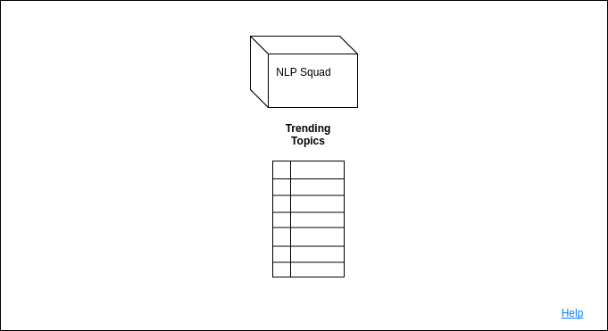
	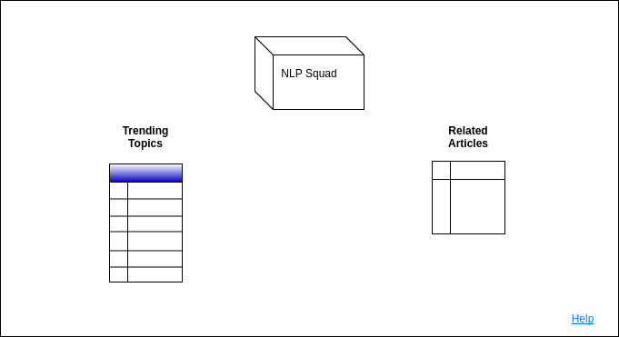
	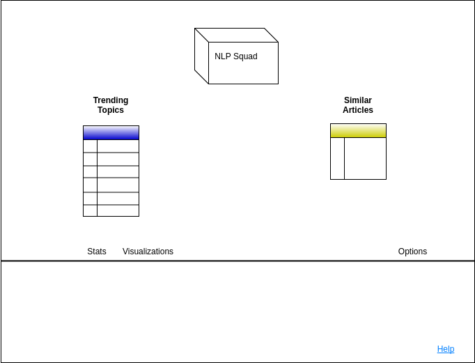
	##### Help
	
	##### Results
	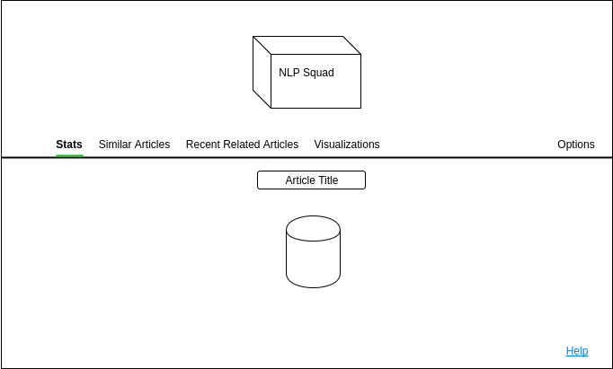
	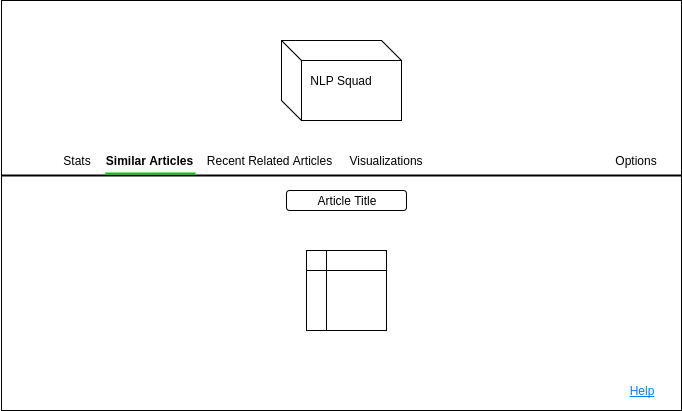
	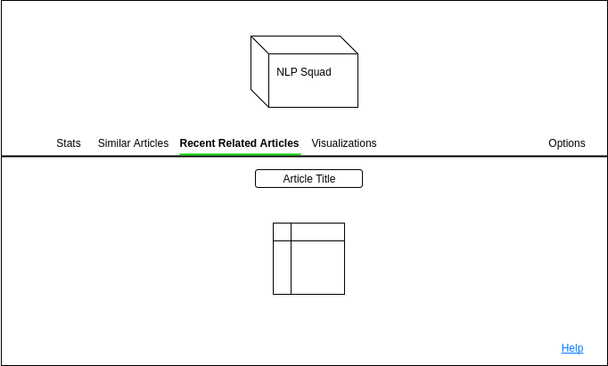
	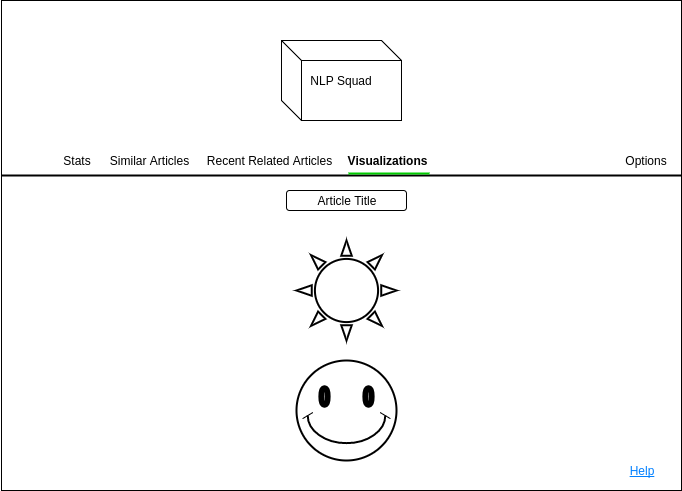
	##### Options
	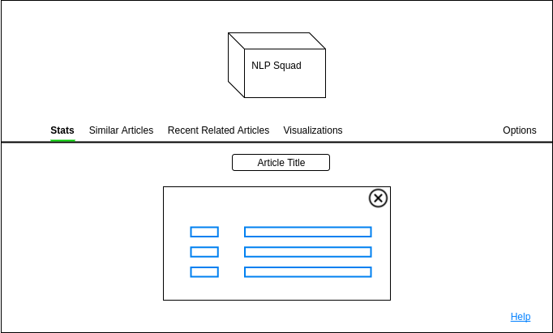)

## Testing

We plan on testing using unit testing, creating testing suites with each new version release of the software. As new features are added,
unit testing will allow us to continuously ensure old functionality while introducing new features. There remains research to be done in this area as far as testing software to use. However, a general plan for testing will resemble the following:

- As new features are written, verify their functionality with unit tests, ensuring all tests are passing before a feature is finished.
Alternatively, development may sometimes being with a test first style of development, writing code to match the tests perceived to
be important to that feature.

- Tests will be consolidated in one testing suite, which will allow old tests to be run along with new features to test that the new
features do not hurt existing functionality.

- A stretch goal for this project will be to implement testing hooks and build automation so that all live code complies with testing
before being put into a live environment. This ensures highly stable code releases, and prevents bad code from being released.

## Prezi
* http://prezi.com/ybpo3byyhwaw/?utm_campaign=share&utm_medium=copy
